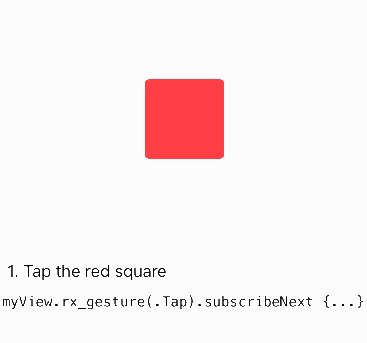

# RxGesture

[](http://cocoapods.org/pods/RxGesture)
[](http://cocoapods.org/pods/RxGesture)
[](http://cocoapods.org/pods/RxGesture)

## Usage



To run the example project, clone the repo, in the __Example__ folder open `RxGesture.xcworkspace`.

You _might_ need to run `pod install` from the Example directory first.

---

__RxGesture__ allows you to easily turn any view into a tappable or swipeable control like so:

```swift
view.rx.tapGesture().when(.recognized).subscribe(onNext: {_ in
   //react to taps
}).addDisposableTo(stepBag)
```

You can also react to more than one  gesture. For example to dismiss a photo preview you might want to do that when the user taps it, or swipes up or down:

```swift
view.rx.anyGesture(.tap(), .swipe([.up, .down])).when(.recognized).subscribe(onNext: {_ in
   //dismiss presented photo
}).addDisposableTo(stepBag)
```

`rx.gesture` is defined as `Observable<G>` where `G` is the actual type of the gesture recognizer so what it emits is the gesture recognizer itself (handy if want to call methods like `asLocation(in view:)` or `asTranslation(in view:)`)

On __iOS__ RxGesture supports:

Use alone | Use alongside other gestures
---------|---------
`view.rx.tapGesture() -> ControlEvent<UITapGestureRecognizer>` | `view.rx.anyGesture(.tap(), ...) -> ControlEvent<UIGestureRecognizer>`
`view.rx.pinchGesture() -> ControlEvent<UIPinchGestureRecognizer>` | `view.rx.anyGesture(.pinch(), ...) -> ControlEvent<UIGestureRecognizer>`
`view.rx.swipeGesture(.left) -> ControlEvent<UISwipeGestureRecognizer>` | `view.rx.anyGesture(.swipe(.left), ...) -> ControlEvent<UIGestureRecognizer>`
`view.rx.panGesture() -> ControlEvent<UIPanGestureRecognizer>` | `view.rx.anyGesture(.pan(), ...) -> ControlEvent<UIGestureRecognizer>`
`view.rx.longPressGesture() -> ControlEvent<UILongPressGestureRecognizer>` | `view.rx.anyGesture(.longPress(), ...) -> ControlEvent<UIGestureRecognizer>`
`view.rx.rotationGesture() -> ControlEvent<UIRotationGestureRecognizer>` | `view.rx.anyGesture(.rotation(), ...) -> ControlEvent<UIGestureRecognizer>`
`view.rx.screenEdgePanGesture() -> ControlEvent<UIScreenEdgePanGestureRecognizer>` | `view.rx.anyGesture(.screenEdgePan(), ...) -> ControlEvent<UIGestureRecognizer>`


On __macOS__ RxGesture supports:

Use alone | Use alongside other gestures
---------|---------
`view.rx.clickGesture() -> ControlEvent<NSClickGestureRecognizer>` | `view.rx.anyGesture(.click(), ...) -> ControlEvent<NSGestureRecognizer>`
`view.rx.rightClickGesture() -> ControlEvent<NSClickGestureRecognizer>` | `view.rx.anyGesture(.rightClick(), ...) -> ControlEvent<NSGestureRecognizer>`
`view.rx.panGesture() -> ControlEvent<NSPanGestureRecognizer>` | `view.rx.anyGesture(.pan(), ...) -> ControlEvent<NSGestureRecognizer>`
`view.rx.pressGesture() -> ControlEvent<NSPressGestureRecognizer>` | `view.rx.anyGesture(.press(), ...) -> ControlEvent<NSGestureRecognizer>`
`view.rx.rotationGesture() -> ControlEvent<NSRotationGestureRecognizer>` | `view.rx.anyGesture(.rotation(), ...) -> ControlEvent<NSGestureRecognizer>`
`view.rx.magnificationGesture() -> ControlEvent<NSMagnificationGestureRecognizer>` | `view.rx.anyGesture(.magnification(), ...) -> ControlEvent<NSGestureRecognizer>`


ℹ️ If you use a gesture recognizer alone, prefer the __Use alone__ syntax because it returns the good `UIGestureRecognizer` subclass and avoid you a cast.

## Filtering State

By default, there is no filter on the state of the gesture recognizer. That means that you will always receive a first event with the initial state of the gesture recognizer (almost always `.possible`).

Here are the preferred states that can be used for each kind of gestures (__iOS__ and __macOS__):

Kind | States
---|---
`.tap()`, `.click()`, `.rightClick()`, `.swipe()`| `.recognized`
`.longPress()`, `.press()`, | `.began`
`.pan()`, `.pinch()`, `.rotation()`, `.magnification()`, `.screenEdgePan()` | `.began`, `.changed`, `.ended`

You usually filter the state using the `.when()` operator:
```swift
view.rx.tapGesture().when(.recognized)
view.rx.panGesture().when(.began, .changed, .ended)
```

If you are observing multiple gestures at once, you can use the `.when()` operator if you want to filter against the same state for __all__ gesture recognizers, or use the tuple syntax for individual filtering:

```swift
view.rx
	.anyGesture(.tap(), .swipe([.up, .down]))
	.when(.recognized)
	.subscribe(onNext { gesture in
		// Called whenever a tap, a swipe-up or a swipe-down is recognized (state == .recognized)
	})
	.addDisposableTo(bag)
	
view.rx
	.anyGesture(
		(.tap(), when: .recognized),
		(.pan(), when: .ended)
	)
	.subscribe(onNext { gesture in
		// Called whenever:
		// - a tap is recognized (state == .recognized) 
		// - or a pan is ended (state == .ended)
	})
	.addDisposableTo(bag)
```


__The demo app includes examples for all recognizers__ (=> [iOS](Example/RxGesture/ViewController.swift), [macOS](Example/RxGesture-OSX/ViewController.swift)).

## Requirements

This library depends on both __RxSwift__ and __RxCocoa__.

## Installation

RxGesture is available through [CocoaPods](http://cocoapods.org). To install
it, simply add the following line to your Podfile:

```swift
pod "RxGesture"
```

## TODO

- can use help about adding tests - UI tests aren't my strongest side
- make pr to RxCocoa to add native support for rx.event to `NSGestureRecognizer` and remove the implementation from this repo

## Thanks

Everyone in the RxSwift Slack channel 💯

## License

RxGesture is available under the MIT license. See the LICENSE file for more info.
